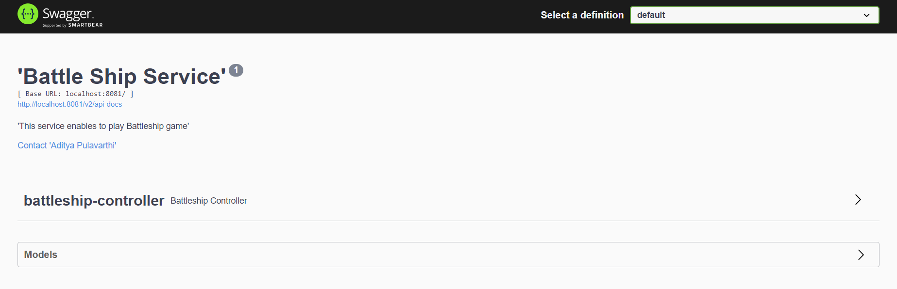
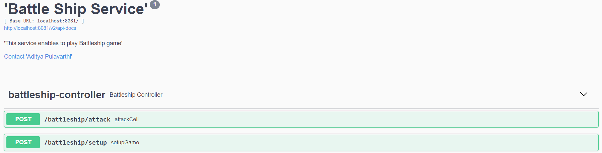
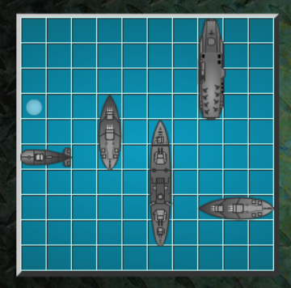

# Battleship Game

## Description:
This service will allow you to play a Battleship game.

Battleship is a classic board game where two players compete against each other to sink each other's fleet of ships. 
The game is played on a 10x10 grid board, where each cell is labeled by letters and numbers (e.g., A1, B2, C3, etc.).

## Rules of the Game

### 1 Game Setup:

Each player has their own grid board, where they will arrange their fleet.
The fleet consists of the following ships, each occupying a certain number of consecutive cells horizontally or vertically:
- Aircraft Carrier (5 cells)
- Battleship (4 cells)
- Cruiser (3 cells)
- Submarine (3 cells)
- Destroyer (2 cells)

Ships can be placed either horizontally or vertically, but not diagonally. They should not overlap or touch each other.

### 2 Gameplay:

Players take turns to try and guess the location of their opponent's ships by calling out a cell on the opponent's grid (e.g., A1, B2, etc.).
The opponent responds with "Hit" if the guess hits a ship or "Miss" if the guess does not hit any ship. The hits and misses are marked on the player's own grid.
If a ship is hit but not entirely sunk, the opponent simply says "Hit" without revealing which ship was hit. If a ship is hit and all its cells are sunk, the opponent declares "Sunk".

### 3 Winning the Game:

The game continues until one player has successfully sunk all their opponent's ships.
The player who sinks all the opponent's ships first is declared the winner.

## Pre-requisite

- Java 11
- Maven
- Git bash (Or any IDE from where you can connect to git)

## Steps to run the application

- Checkout the code / Download from git repo(https://github.com/adityapnv/battleship-service.git)
- checkout : open git bash and run command `git clone https://github.com/adityapnv/battleship-service.git`
- open command prompt(cmd)
- go inside the project folder
- run command `mvn clean install`
- once its successfully build run command `mvn spring-boot: run`

Now application is up and running

## How to Play

- Open the URL in your browser : http://localhost:8081/swagger-ui/index.html
- You will see a swagger page with all the defined specs of the service.

1. #### POST: battleship/setup
- Start the game by setting up your fleet of ships using this endpoint. Provide your name and the starting cell positions of your ships to place them on your grid board.

2. #### POST: battleship/attack
- Once both players have set up their fleets, take turns attacking each other using the /attack endpoint. 
- Use the above generated gameId and guess the cell position you want to attack on your opponent's grid by providing your name and the cell position.
- The opponent will respond with "Hit" if your attack hits one of their ships or "Miss" if it does not hit anything. Keep track of your guesses and the hits or misses.
- If you hit an opponent's ship but don't sink it entirely, the response will be "Hit" without revealing which ship was hit. If you sink an opponent's ship, the response will be "Sunk".
- Continue taking turns attacking each other until one player successfully sinks all the opponent's ships.
- The player who sinks all the opponent's ships first is declared the winner.

## Note:
- The attacking player's turn continues when the opponent responds with 'Hit' or 'Sunk'.
- The player's turn will not change if the player chooses an already attacked cell.
- The player's turn changes when the opponent responds with 'Miss'.

### Actual Game For Reference

Have fun playing Battleship!

